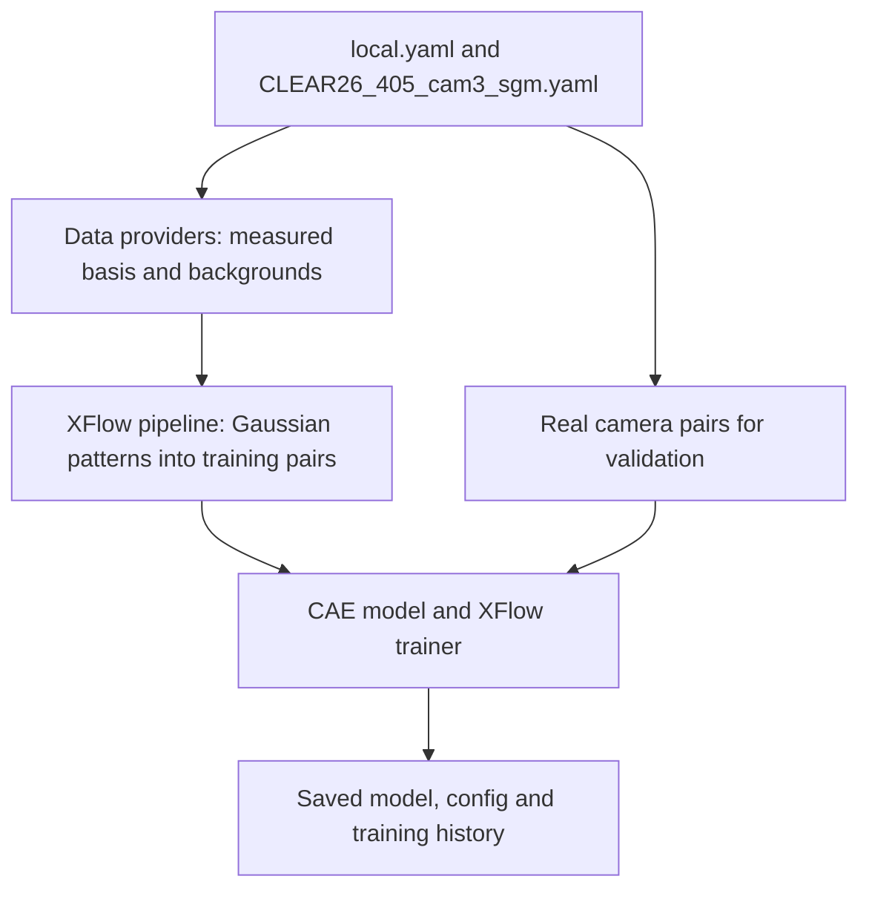

# Fiber image reconstruction

## Overview

This project compares models for reconstructing beam images from multimode-fiber camera images. Its CLEAR26 experiments use XFlow to train on synthetic image pairs built from measured camera responses and beam patterns, then validate on real camera pairs. Experiment configs define the data, model and training settings.

## Minimal example

This example uses `CLEAR26_405_cam3_sgm.yaml`: cam3 is the fiber input, cam2 is the beam target, and the model is a convolutional autoencoder (CAE).

Use a Python 3.12 environment. Clone both repositories into the same folder and install:

```bash
git clone https://github.com/Andrew-XQY/XFlow.git
git clone https://github.com/Andrew-XQY/fiber-image-reconstruction-comparison.git
cd fiber-image-reconstruction-comparison
python -m pip install -e "../XFlow[ml_torch,ext]" omegaconf opencv-python
```

Create `conf/machine/local.yaml`. Keep these keys and replace the paths with your processed CLEAR26 dataset folders:

```yaml
paths:
  datasets:
    processed_405_background_256: "D:/data/background"
    processed_405_stimuation_large_256: "D:/data/basis"
    processed_405_realbeam_eval_256: "D:/data/evaluation"
  output_root: "./results/first-run"
```

Each dataset folder needs `dataset.db` with the camera/sample metadata and its referenced 16-bit, 256-by-256 images. The datasets are not included. Choose a new output folder for each run.

Save this as `run_example.py` in the repository root. It selects the machine profile and experiment, then calls the training entry point:

```python
import os

os.environ["MACHINE"] = "local"
os.environ["EXPERIMENT_CONFIG"] = "CLEAR26_405_cam3_sgm"

from train import main

main()
```

Run it from the repository root:

```bash
python run_example.py
```

Training saves `model.pt`, the run config, `history.json` and reconstruction previews in `results/first-run`.

## Workflow

For this config, Gaussian patterns combine the measured basis into synthetic training pairs. `utils.py` builds the data providers and pipelines, `models/CAE.py` defines the model, and `train.py` runs training.


